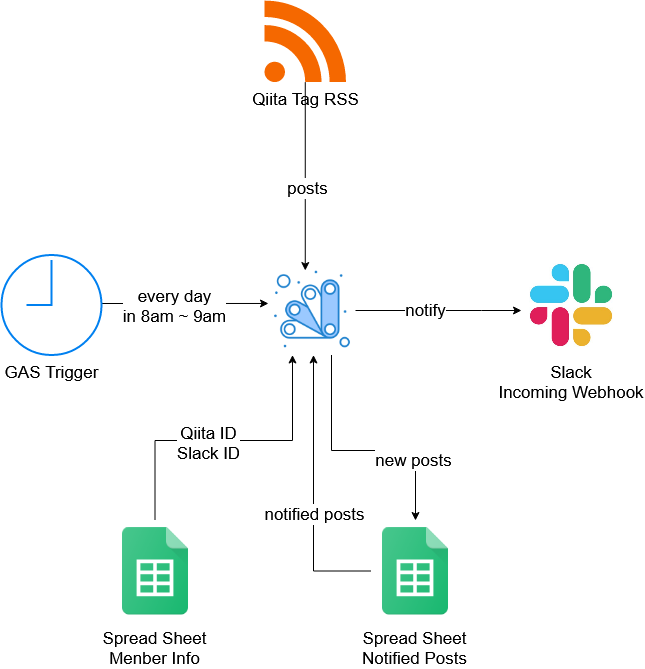

## 概要
特定のタグへのQiita投稿を、SlackのIncoming Webhookに投げつけ、メンション付きで投稿記事を通知するGASBot

### アーキテクチャ

## 仕様
- [GASの時間主導型トリガー](https://note.com/tamo_3/n/n6a5453454259)で、毎日午前8時~9時に以下のロジックを実行
  1. タグのRSSに存在する全記事のURL、タイトル、投稿者を取得
  1. GSSの「連携済み」シートから、Slack通知済みURLの一覧を取得
  1. 1.のリストをループで回す。URLが2.のリストに含まれていない場合は以下を実行(含まれていた場合は何もしない)
      - GSSの「連携済み」シートにURLを追加
      - Slackに、投稿した人へのメンションと投稿した記事をポスト(Qiita IDとSlack IDの紐づけはGSSの「メンバー管理」シート)

## 使い方
* [この構造](https://docs.google.com/spreadsheets/d/1r5vnaJSjul0SBAP8N8-4NVqlt9S3UO1ifwQuJRwHgVo/edit?usp=sharing)のGSSシートを準備
* ツール => スクリプトエディタ よりスクリプトエディタを開き、`libraries.gs`と`timeline.gs`を配置
* スクリプトエディタの ファイル => プロジェクトのプロパティ => スクリプトのプロパティ より以下KeyでURLをセット
    - ADVENT_RSS_URL: 連携したいQiitaのRSSのURL
    - ADVENT_WEBHOOK_URL: SlackのIncoming Webhook URL
* GASのトリガーで`timeline.gs`の`main`関数を定期実行

Qiitaのアドベントカレンダーで[紹介記事](https://qiita.com/cold-wisteria/items/640d50edeffea05dae86)を書いています！  
他のアドカレ記事もぜひご覧ください！  
https://qiita.com/advent-calendar/2020/whi  
https://qiita.com/advent-calendar/2020/whi-2  